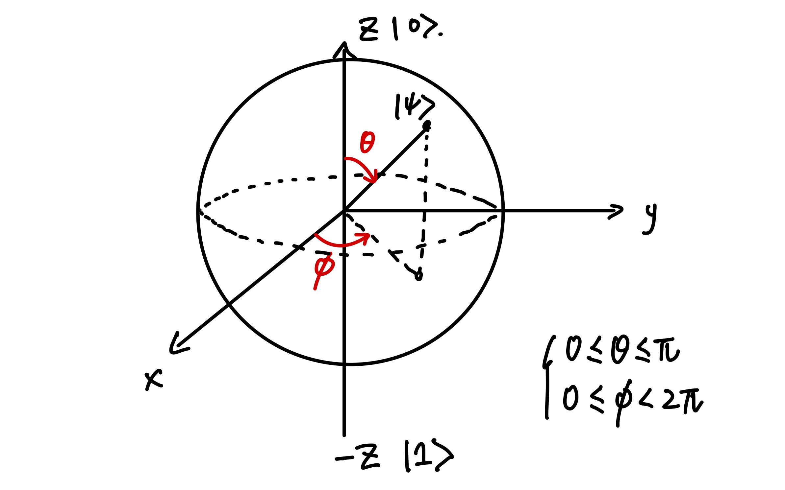

# Bloch sphere

## Basic introduction

Bloch sphere representation of a "single qubit state".

    
    

        Bloch shpere
    

If we ahve any qubit state $|\psi\rangle \in \mathbb{C}^{2}$ can be mapped to a point on the bloch sphere. Assume state $|\psi\rangle$ such that 

$$
|\psi\rangle = \alpha|0\rangle + \beta|1\rangle, \ \alpha, \beta \ \in \mathbb{C}, \ \alpha^{2}+\beta^{2} = 1
$$

We set 

$$
\alpha = \text{cos} \frac{\theta}{2} e^{i\delta}, \ \beta = \text{sin} \frac{\theta}{2} e^{i(\delta+\phi)}
$$

thus,

$$
\begin{array}{ll}
|\psi\rangle & = \text{cos} \frac{\theta}{2} e^{i\delta}|0\rangle + \text{sin}\frac{\theta}{2} e^{i(\delta+\phi)}|1\rangle \\
& = e^{i\delta}(\text{cos}\frac{\theta}{2}|0\rangle + \text{sin}e^{i\phi}\frac{\theta}{2}|1\rangle)
\end{array}
$$

where $e^{i\delta}$ is a global phase, somce it has same effects on $|0\rangle$ and $|1\rangle$ and cannot measure duing experiment, we can ignore it.

For the relative phase, $e^{i\phi}$, can canont ignore it. We set $\text{sin}$ and $\text{cos}$ a non-negative $\mathbb{R}$. From the bloch sphere, we can have 

$$
\begin{array}{ll}
x = \text{sin}\theta\text{cos}\phi\\
y = \text{sin}\theta\text{sin}\phi\\
z = \text{cos}\theta
\end{array}
$$

where 

$$
\begin{array}{ll}
0 \leq \theta \leq \pi\\
0 \leq \phi < 2\pi\\
\end{array}
$$

thus,

$$
|\psi\rangle = \text{cos} \frac{\theta}{2}|0\rangle + \text{sin} \frac{\theta}{2}e^{i\theta}|1\rangle.
$$

## Common representations
### Z-basis (computational basis)

-   $|0\rangle$: North pole (z = 1)
-   $|1\rangle$: South pole (z = -1)

### X-basis

-   $|+\rangle = \frac{1}{\sqrt{2}}(|0\rangle + |1\rangle)$ (x axis)
-   $|-\rangle = \frac{1}{\sqrt{2}}(|0\rangle - |1\rangle)$ (-x axis)

### Y-basis

-   $|i+\rangle = \frac{1}{\sqrt{2}}(|0\rangle + i|1\rangle)$ (y axis)
-   $|i-\rangle = \frac{1}{\sqrt{2}}(|0\rangle - i|1\rangle)$ (-y axis)

## References 

[1]. [https://en.wikipedia.org/wiki/Bloch_sphere](https://en.wikipedia.org/wiki/Bloch_sphere)