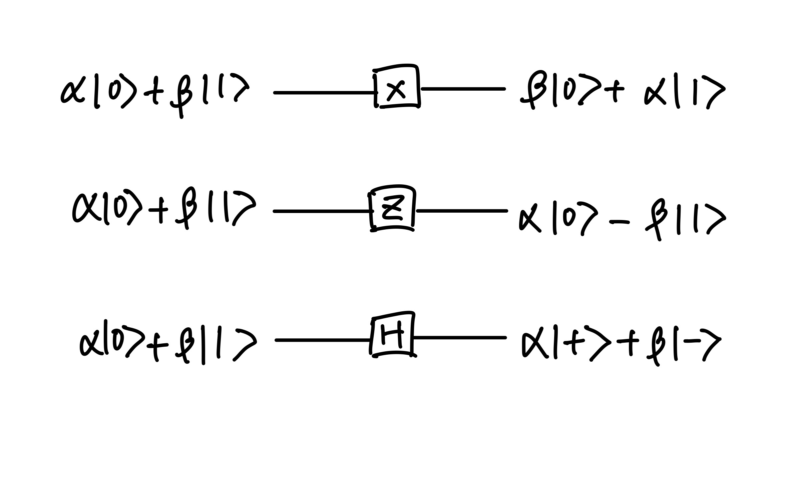
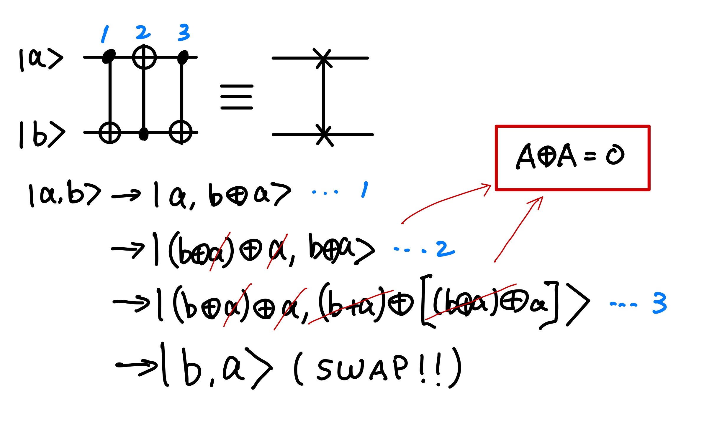

## Single qubit gates 

Classical computer circuits consist of *wires* and *logic gates*.

Suppose we define a matrix $X$ ro represent the quantum `NOT` gate as follows:

$$
X \equiv \begin{bmatrix} 0 & 1 \\ 1 & 0 \end{bmatrix}.
$$

If the quantum state $\alpha|0\rangle + \beta|1\rangle$ is written in a vector notation as 

$$
\begin{bmatrix} \alpha \\ \beta \end{bmatrix}
$$

with teh top entry corresponding to teh amplitude for $|0\rangle$ and the bottom entry the amplitude for $|1\rangle$, then the corresponding output from the quantum `NOT` gate is 

$$
X \begin{bmatrix} \alpha \\ \beta \end{bmatrix} = \begin{bmatrix} \beta \\ \alpha \end{bmatrix}.
$$

==So we know that quantum gates on a single qubit can be described by 2-2 matrices.== The appropriate condition on the matirx representing the gate is taht the matrix $U$ describing the single qubit be *unitary*, that is, $U^{\dagger}U = I$, where $U^{\dagger}$ is an adjoint of $U$ (obtained by transponsing and then complex conjugating $U$), and $I$ is the 2-2 identity matrix. For example, $X^{\dagger}X = I$. And this is the **only** constrain on quantum gates.

## Z gate

The Z gate

$$
Z \equiv \begin{bmatrix} 1 & 0 \\ 0 & -1 \end{bmatrix}.
$$

We can clearly see that $Z$ gate flips the sign of the state $|1\rangle$. Given 

$$
\begin{array}{lll}
Z|\psi\rangle & = & \alpha Z|0\rangle + \beta Z|1\rangle \\
 & = & \alpha |0\rangle - \beta |1\rangle \\
 & = & \text{cos}(\frac{\theta}{2})|0\rangle - e^{i\phi} \text{sin}(\frac{\theta}{2})|1\rangle \\
 & = & \text{cos}(\frac{\theta}{2})|0\rangle + e^{i(\phi + \pi)} \text{sin}(\frac{\theta}{2})|1\rangle \\
\end{array}
$$

where 

$$
e^{i\pi} + 1 = 0 \ (\text{Euler's formula})
$$

by [Euler's formula](https://en.wikipedia.org/wiki/Euler%27s_formula). We can tell that $Z$ gates rotate the state along Z axis on XY-plane ($\phi$) with $\pi$ degrees in a Bloch shpere.

## Hadamard gate

$$
H \equiv \frac{1}{\sqrt{2}}\begin{bmatrix} 1 & 1 \\ 1 & -1 \end{bmatrix}.
$$

It turns a $|0\rangle$ into $(|0\rangle + |1\rangle)/\sqrt{2}$ (first column of $H$), 'halfway' bewteen $|0\rangle$ and $|1\rangle$, and it turns $|0\rangle$ into $(|0\rangle - |1\rangle)/\sqrt{2}$ (second column of $H$), which is also 'halfway' bewteen $|0\rangle$ and $|1\rangle$. The Hadamard gate is one of the most useful quantum gates, it turns out that single qubit gates correspond to ratations and reflections of the sphere. ==The Hadamard operation is just a roatation of the spohere about the $y$ axis by $\pi/2$, followed by a rotation about $x$ axis by $\pi$.==

$$
\begin{array}{lll}
H|0\rangle & = & \frac{(|0\rangle + |1\rangle)}{\sqrt{2}} = |+\rangle\\
H|1\rangle & = & \frac{(|0\rangle - |1\rangle)}{\sqrt{2}} = |-\rangle
\end{array}
$$

    
    

        Single qubit gate examples of X, Z, and H gate.
    

An arbitrary singel qubit unitary gate can be decompsed as a product of rotations 

$$
\begin{bmatrix} 
\text{cos}\frac{\gamma}{2} & -\text{sin}\frac{\gamma}{2} \\ 
\text{sin}\frac{\gamma}{2} & \text{cos}\frac{\gamma}{2} 
\end{bmatrix},
$$

and a gate being rotation about the $z$ axis.

$$
\begin{bmatrix}
e^{-i\beta/2} & 0 \\ 
0 & e^{i\beta/2}
\end{bmatrix},
$$

together with a *(global) phase shift* - a constand multiplier of the form $e^{i\alpha}$. We don't need to be able to do these gates for arbitrary $\alpha$, $\beta$, $\gamma$ but can build arbitrarily good approximations to such gates using only certain
special fixed values of $\alpha$, $\beta$ and $\gamma$. An arbitrary $2\times 2$ unitary matrix may be decomposed as 

$$
U = e^{i\alpha}
\begin{bmatrix}
e^{-i\beta/2} & 0 \\ 
0 & e^{i\beta/2}
\end{bmatrix}
\begin{bmatrix} 
\text{cos}\frac{\gamma}{2} & -\text{sin}\frac{\gamma}{2} \\ 
\text{sin}\frac{\gamma}{2} & \text{cos}\frac{\gamma}{2} 
\end{bmatrix}
\begin{bmatrix}
e^{-i\delta/2} & 0 \\ 
0 & e^{i\delta/2}
\end{bmatrix},
$$

where $\alpha$, $\beta$, $\gamma$ and $\gamma$ are real-valued. Notice that the second matrix is just an ordinary rotation. ==It turns out that the first and last matrices can also be understood as rotations in a different plane.==

## CNOT gate

A controlled-NOT gate, also called CNOT gate, which has two input qubits, known as the *control* and *target* qubit, respectively. The action of the gate can be summarized as 

$$
|A,B\rangle \rightarrow |A, B\oplus A\rangle
$$

where $\oplus$ is [addition modulo two](../Quantum_Algorithm_101/modular_arithmetic.md). The results of a two-qubit input can be 

$$
\begin{array}{c}
|00\rangle \rightarrow |00\rangle \\
|01\rangle \rightarrow |01\rangle \\
|10\rangle \rightarrow |11\rangle \\
|11\rangle \rightarrow |10\rangle 
\end{array}
$$

in a matrix format

$$
\begin{bmatrix}
1 & 0 & 0 & 0 \\
0 & 1 & 0 & 0 \\
0 & 0 & 0 & 1 \\
0 & 0 & 1 & 0 
\end{bmatrix}
$$

Of course, `CNOT` gate is also a *unitary matrix* where $U^{\dagger}_{CNOT}U_{CNOT} = I$. However, in a sense the `CNOT` and single qubit gates are the prototypes for *all* other gates because of the following remarkable *universality* result: ==*Any multiple qubit logic gate may be composed from `CNOT` and single qubit gates*.==

## SWAP gate

The SWAP gate swaps the states of the two qubits. To see that this circuit accomplishes the swap operation, note that the sequence of gates has the following sequence of effects on a computational basis state

    
    

        SWAP gate for 2-qubit state
    

where all additions are done modulo 2. Mathematically, the SWAP gate's action on a quantum state is 

$$
\text{SWAP}(|\psi_{1}\rangle|\psi_{2}\rangle) = |\psi_{2}\rangle|\psi_{1}\rangle
$$

The matrix fomat is 

$$
\text{SWAP} = 
\begin{bmatrix}
1 & 0 & 0 & 0 \\
0 & 0 & 1 & 0 \\
0 & 1 & 0 & 0 \\
0 & 0 & 0 & 1 
\end{bmatrix}
$$

The SWAP gate is extremely useful in hardware settings; if two qubits are not physically connected, we can simply swap one of those qubits with another that is physically connected to the other qubit. The SWAP gate may also appear as a necessary part in building the quantum Fourier transform or in other routines such as the SWAP test.

## Basic

we can write the vector representation for 2 qubits as

$$
\lvert \psi \rangle = v_{00} \lvert 00 \rangle + v_{01}\lvert 01 \rangle + v_{10} \lvert 10 \rangle + v_{11} \lvert 11 \rangle\ \rightarrow 
\begin{bmatrix}
v_{00} \\
v_{01} \\
v_{10} \\
v_{11} \\
\end{bmatrix}
$$

## Unitary Matrices
From the quantum mechanics, the only matrics that we can use are the **unitary** matrices, which are the matrices $U$ such that:
$$
U^{\dagger}U = UU^{\dagger} = I,
$$
where $I$ is the identity matrix and $u^{\dagger}$ is the adjoint of U, that is, the matrix obtained by transposing $U$ and replaing each element by its complex conjugate. {==This means that any unitary matrix $U$ is invertible and its inverse is given by $U^\dagger$==}. in quantum mechanics, the operations represented by these matrices are called **quantum gates**.

## CNOT Gate

CNOT gate: The value of the second qubit is flipped if and only if the value of the first
qubit is 1.

Matrix Representation of the CNOT Gate
In the computational basis $\{\lvert 00 \rangle,\lvert 01 \rangle, \lvert 10 \rangle, \lvert 11 \rangle\}$, the CONT gate is represented as a **4x4 matrix**:

$$
\text{CNOT} =
\begin{bmatrix}
1 & 0 & 0 & 0 \\
0 & 1 & 0 & 0 \\
0 & 0 & 0 & 1 \\
0 & 0 & 1 & 0
\end{bmatrix}
$$

- The first qubit is the control qubit.
- The second qubit is the target qubit.

And, if we apply `CNOT` gate on the element of the two-qubit computational basis, we can get,

$$
\begin{array}{cccc}
    \text{CNOT}\lvert00\rangle = \lvert00\rangle,& 
    \text{CNOT}\lvert01\rangle = \lvert01\rangle,& 
    \text{CNOT}\lvert10\rangle = \lvert11\rangle,& 
    \text{CNOT}\lvert11\rangle = \lvert10\rangle
\end{array}
$$

## Hadamard Gate

The Hadamard gate is a single-qubit operation that maps the basis state $\lvert 0 \rangle$ to $\frac{\lvert 0 \rangle + \lvert 1 \rangle}{\sqrt{2}}$ and $\lvert 1 \rangle$ to $\frac{\lvert 0 \rangle - \lvert 1 \rangle}{\sqrt{2}}$, which creates an equal superposition of the basis states.

$$
H = \frac{1}{\sqrt{2}} 
\begin{bmatrix}
1 & 1  \\
1 & -1  \\
\end{bmatrix}
$$

if we apply $H$ gate on a qubits in state $\lvert 0 \rangle$ and $\lvert 1 \rangle$, we have:

$$
H\lvert0\rangle = \frac{1}{\sqrt{2}}(\lvert0\rangle+\lvert1\rangle)
$$

which is called **mplus** state and it is denoted as $\lvert+\rangle$; and 

$$
H\lvert1\rangle = \frac{1}{\sqrt{2}}(\lvert0\rangle-\lvert1\rangle)
$$

which is called **minus** state and it is denoted as $\lvert-\rangle$.

## Pauli-X gate
The pauli-X gate is a single-qubis rotation through $\pi$ radians around the X-axis. $X$ gate is also called `NOT` gate, since it performs like a `NOT` gate in classical digital circuits. Here's why:

$$
X = 
\begin{bmatrix}
0 & 1  \\
1 & 0 \\
\end{bmatrix}
$$

Apply $X$ gate to $\lvert 0 \rangle$ and $\lvert 1 \rangle$, we have:

$$
X\lvert0\rangle =  
\begin{array}{cc}
\begin{bmatrix}
0 & 1  \\
1 & 0 \\
\end{bmatrix}
\begin{bmatrix}
1 \\
0 \\
\end{bmatrix}
= \begin{bmatrix}
0 \\
1 \\
\end{bmatrix}
= \lvert 1 \rangle
,& 
X\lvert1\rangle =  
\begin{bmatrix}
0 & 1  \\
1 & 0 \\
\end{bmatrix}
\begin{bmatrix}
0 \\
1 \\
\end{bmatrix}
= \begin{bmatrix}
1 \\
0 \\
\end{bmatrix}
= \lvert 0 \rangle
\end{array}
$$

## Pauli-Y gate 
The Pauli-Y gate is a single-qubit rotation through π radians around the y-axis.

$$ 
Y = \sigma_{y} = \sigma_{2} =
\begin{bmatrix}
0 & -i  \\
i & 0  \\
\end{bmatrix}
$$

## Pauli-Z gate
The Pauli-Z gate is a single-qubit rotation through π radians around the z-axis.

$$ 
Z = \sigma_{z} = \sigma_{3} =
\begin{bmatrix}
1 & 0  \\
0 & -1 \\
\end{bmatrix}
$$

What if we apply an $H$ gate, then an $X$ gate and, finally, another $H$ gate. we have:

$$
Z = 
\begin{bmatrix}
1 & 0\\
0 & -1 \\
\end{bmatrix}
$$

and we have the following properties for when we apply $Z$ on $\lvert 0 \rangle$ and $\lvert 1 \rangle$:

$$
\begin{array}{ccc}
Z \lvert0\rangle = \lvert0\rangle & \text{and} & Z\lvert1\rangle = -\lvert1\rangle
\end{array}
$$

## S gates
S gate is given by:

$$
S = 
\begin{bmatrix}
1 & 0  \\
0 & e^{i\frac{\pi}{2}} \\
\end{bmatrix}
$$

## T gates
T gate is given by:

$$
T = 
\begin{bmatrix}
1 & 0  \\
0 & e^{i\frac{\pi}{4}} \\
\end{bmatrix}
$$

## References 

[1] M. A. Nielsen and I. L. Chuang, *Quantum Computation and Quantum Information*, 10th Anniversary Ed., Cambridge: Cambridge University Press, 2010.

[2]. [https://pennylane.ai/qml/glossary/what-is-a-swap-gate](https://pennylane.ai/qml/glossary/what-is-a-swap-gate)

---

## Reference
1. https://www.quantum-inspire.com/kbase/pauli-x/

