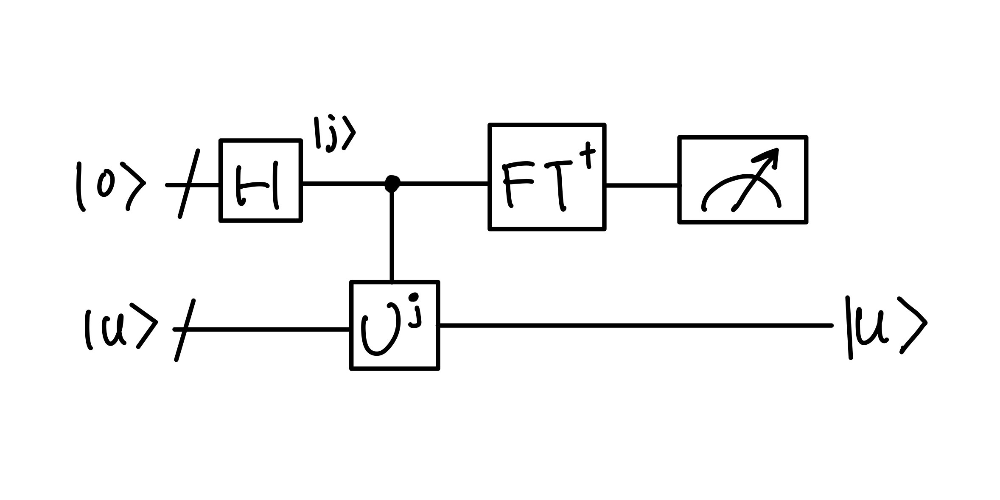

# Quantum Fourier Transformation (QFT)

## Introduction of QFT
One of the most useful ways to solving a probllem in mathematics or computer science is to *transform* it into some other problem for which a solution is known. One such transformation is the *discrete Fourier transform*. in the usual mathematical notiation, the discrete Fourier transform takes vector is a fixed parameter. It outputs the $x_{0},...,x_{N-1}$ where the length $N$ of the vector is a fixed paramter. It outpus the transformed data, a vector of complex numbers $y_{0},...,y_{N-1}$, defined by 

$$
y_{k} \equiv \frac{1}{\sqrt{N}}\sum_{j=0}^{N-1}x_{j}e^{2\pi ijk/N}.
$$

The *quantum Fourier transformation* is exactly the same transformation, although the conventional notation for the quantum Fourier transformation is somewhat different. The quantum Fourier transform on an orthonormal basis $|0\rangle,...,|N-1\rangle$ is defined to be a *linear opearator* with the following action on the basis state,

$$
|j\rangle \mapsto \frac{1}{\sqrt{N}}\sum_{k=0}^{N-1}e^{2\pi ijk/N} |k\rangle.
$$

Equivalently, the action on an arbitrary state may be written 

$$
\sum_{j=0}^{N-1}x_{j}|j\rangle \mapsto \sum_{k=0}^{N-1}x_{k}|k\rangle,
$$

where the amplitudes $y_k$ are the discrete Fourier transform of the amplitudes $x_j$. It is not obvious from the definition, but this transformation is a [**unitary transformation**](../Quantum_Algorithm_101/hilbert_space.md#unitary-operators), and thus can be implmented as the dynamics for a quantum computer. 

!!! Example "Give a direct poof that the linear transformation defined by $|j\rangle \mapsto \frac{1}{\sqrt{N}}\sum_{k=0}^{N-1}e^{2\pi ijk/N} |k\rangle$ is unitary"

!!! Example "Explicitly compute the Fourier transform of the $n$ qubit state $|00...0\rangle$"

In the following, we take $N = 2^{n}$, where $n$ is some integer, and the basis $|0\rangle,...,|2^{n}-1\rangle$ is the computational basis for an $n$ qubit quantum computer. We write the state $|j\rangle$ using the binary representation $j = j_{1}j_{2}...j_{n}$. That is, $j = j_{1}2^{n-1}+j_{2}2^{n-2} + \cdots + j_{n}2^{0}$. For example, $|101\rangle$, where $j_{1} = 1$, $j_{2} = 0$, and $j_{3} = 1$. In decimal, $j = 1\cdot 2^{2} + 0\cdot 2^{1} + 1\cdot 2^{0} = 5$.

In the binary fraction format, $0.j_{l}j_{l+1}...j_{n} = \frac{j_{l}}{2} + \frac{j_{l+1}}{4} + ... \frac{j_{m}}{2^{m-l+1}}$. we have 

$$
0.101 = \frac{1}{2} + 0 + \frac{1}{8} = \frac{5}{8}
$$

The product representation of the quantum Fourier transformation can be shown as 

$$
|j_{1},...,j_{n}\rangle \mapsto \frac{(|0\rangle + e^{2\pi i0.j_{n}}|1\rangle)(|0\rangle + e^{2\pi i0.j_{n-1}j_{n}}|1\rangle)(|0\rangle + e^{2\pi i0.j_{1}j_{2}\cdots j_{n}}|1\rangle)}{2^{n/2}}.
$$

> This production representation is so useful that you amy even wish to consider this to be the ==*definition*== of the Quantum Fourier transformation.

For above example $|j\rangle = |101\rangle$,

$$
|j\rangle \mapsto \frac{1}{2^{3/2}}\bigotimes_{k=1}^{3}(|0\rangle + e^{2\pi \cdot 0.j_{k}j_{k+1}...j_{n}}|1\rangle)
$$

We compute eacj phase using the binary fraction notation for the first qubit:

$$
0.j_{1}j_{2}j_{3} = 0.101 = \frac{1}{2} + \frac{0}{4} + \frac{1}{8} = \frac{5}{8}
$$

so the first term is $|0\rangle + e^{2\pi i\cdot 5/8}|1\rangle$. Similarly, the second quibit 

$$
0.j_{2}j_{3} = 0.01 = \frac{0}{2} + \frac{1}{4}  = \frac{1}{4}
$$

so the second term is $|0\rangle + e^{2\pi i \cdot 1/4} |1\rangle$. Lastly, the third qubit 

$$
0.j_{3} = 0.1 = \frac{1}{2}
$$

so the third term is $|0\rangle + e^{2\pi i \cdot 1/2}|1\rangle$. Putting everything together 

$$
|101\rangle \mapsto \frac{1}{2^{3/2}}(|0\rangle + e^{2\pi i\cdot 5/8}|1\rangle)\otimes(|0\rangle + e^{2\pi i \cdot 1/4} |1\rangle)\otimes(|0\rangle + e^{2\pi i \cdot 1/2}|1\rangle)
$$

This is the QFT of $|101\rangle$ in product form.

The equivalence of the product representation and the definition follows from some elementary algebra:

==TODO: eq 5.5 - 5.10==

$$
\begin{array}{ll}
|j\rangle& \mapsto \frac{1}{2^{n/2}}\sum_{k=1}^{2^{n}-1} e^{2\pi ijk/2^{n}}|k\rangle \\
 & = d
\end{array}
$$

## QFT circuit
The product representation $|j_{1},...,j_{n}\rangle$ makes it easy to derive an efficient circuit for the quantum Fourier transform. The gate $R_k$ denotes the unitary transformation 

$$
R_{k} \equiv
\begin{bmatrix}
1 & 0\\ 0 & e^{2\pi i/2^{k}}
\end{bmatrix}
$$

Let's see how to derive the product form from the QFT circuit.

    
    

        Efficient circuit for the quantum Fourier transform. Not shown are swap gates at the end of the circuit which reverse the order of the qubitsm or normalization factors of \( 1/\sqrt{2} \) in the output.
    

Condsidering what happens when the state $|j_{1},,,j_{n}\rangle$ is input. Apply Hadamard gate to the first bit produces the state (keep your eyes on $j_{1}$ in the circuit!)

$$
|\psi\rangle_{j_1|H} = \frac{1}{2^{1/2}}(|0\rangle + e^{2\pi i 0.j_1}|1\rangle)|j_{2}...J_{n}\rangle,
$$

since $e^{2\pi i 0.j_{1}} = -1$ when $j_1 = 1$, and is $+1$ otherwise. Applying the controlled-$R_2$ gate produces the state 

$$
|\psi\rangle_{j_1|H,R_2} = \frac{1}{2^{1/2}}(|0\rangle + e^{2\pi i 0.j_1j_2}|1\rangle)|j_{2}...J_{n}\rangle.
$$

where $j_1|H$ represent system state after applying $H$ on $j_1$ and $j_1|H,R_2$ represent system state applying $R_2$ on $j_1|H$. Then simialiry, we continue apply the controll-$R_3$, $R_4$ throug $R_n$ gates, each of which adds an extra but to the phase of the coeffifient of the first $|1\rangle$. At the end of this procedure we have the state for $|\psi\rangle_{j_1}$

$$
|\psi\rangle_{j_1|H,R_2,...,R_n} = \frac{1}{2^{1/2}}(|0\rangle + e^{2\pi i 0.j_1j_2...j_n}|1\rangle)|j_{2}...j_{n}\rangle.
$$

Then, we do the same thing on the second qubit. The $H$ gate puts us in the state 

$$
\frac{1}{2^{1/2}}(|0\rangle + e^{2\pi i 0.j_1j_2...j_n}|1\rangle)(|0\rangle + e^{2\pi i 0.j_2}|1\rangle)|j_{3}...j_{n}\rangle,
$$

then, again, we apply the controll-$R_2$ to $R_{n-1}$, the system state becomes 

$$
\frac{1}{2^{1/2}}(|0\rangle + e^{2\pi i 0.j_1j_2...j_n}|1\rangle)(|0\rangle + e^{2\pi i 0.j_2...j_n}|1\rangle)|j_{3}...j_{n}\rangle,
$$

We continue in this fashion for each qubit, it gives a final state 

$$
\frac{1}{2^{1/2}}(|0\rangle + e^{2\pi i 0.j_1j_2...j_n}|1\rangle)(|0\rangle + e^{2\pi i 0.j_2...j_n}|1\rangle)\cdots (|0\rangle + e^{2\pi i 0.j_n}|1\rangle),
$$

==We omitted the Swap operation, which is used to reverse the order of the qubits, for clarity.== After Swap gate, the final state will be 

$$
\frac{1}{2^{1/2}}(|0\rangle + e^{2\pi i 0.j_n }|1\rangle)(|0\rangle + e^{2\pi i 0.j_{n-1}...j_{n}}|1\rangle)\cdots (|0\rangle + e^{2\pi i 0.j_1j_2...j_n}|1\rangle)
$$

this form matches the product representation mentioned above. So the next question will be how many gates does this circuit ues? 

1.  We know that we apply $H$ to every qubit, therefore we have $n \times H$ gates. 
2.  Next, we apply $n-1 \times R_{k}$ on the first qubit, $n-2 \times R_{k}$ on the second qubit, and $0 \times R_{k}$ on the last qubit. Therefore, a total of $(n-1) + (n-2) + \cdots (n-n) = \frac{n(n-1)}{2}$ $R_k$ gates. Finally, we have $n + \frac{n(n-1)}{2} = \frac{n(n+1)}{2}$ gates for the circuti. 
3. Then we require at most of $n/2$ swap gates, which can be represented as $3\otimes$ CNOT gates. 

Therefore, the canonical QFT provides $\Theta(n^{2})$ algorithm for performing the quantum Fourier transform.

## Phase Estimation 

The Quantum Fourier transformation is the key to a general procedure know as *phase estimation*, which in turn is the key for many quantum algorithms. Suppose a unitary operator $U$ has an eigenvector $|u\rangle$ with eigenvalue $e^{2\pi i\phi}$,  where the value of $\phi$ is unknown. The goal of the phase estimation is to estimate $\phi$. To perform the estimation we assume that we have available *black boxes (oracles)* capable of preparing the state $|u\rangle$ and performing the controlled-$U^{2^{j}}$ operation, for sutible non-negative integers $j$.

The quantum phase estimation procedure uses two registers. The first register contains $t$ qubits initially in the state $|0\rangle$. How we choose $t$ depends on two things:

1.  The number of digits of accuracy we wish to have in our estimate for $\phi$.
2.  With what probability we wish the phase estimation precedure to be successful. 

The second register begins in the state $|u\rangle$, and contains as many qubits as is necessary to store $|u\rangle$.

Phase estimation is performed in two stages. 

1.  First, the circuit begins by applying a Hadamard transform to the first register, followed by application of controlled-$U$ operations on the second register, with $U$ raised to successive powers of two. The final state of the first registers can be seen as:

$$
\frac{1}{2^{t/2}}(|0\rangle + e^{2\pi i (2^{t}-1)\phi}|1\rangle)(|0\rangle + e^{2\pi i (2^{t}-2)\phi}|1\rangle)...(|0\rangle + e^{2\pi i (2^{0})\phi}|1\rangle) = \frac{1}{2^{t/2}}\sum_{k=0}^{2^{t}-1}e^{2\pi i \phi k}|k\rangle
$$

We omit the second register from this description, since it stays in the state $|u\rangle$ throughout the computation.

    
    

        The frist stage of the phase estiamtion procedure. Normalization factors of \( 1/\sqrt{2} \) have been omitted on the right.
    

2.  The second stage of the phase estimation is to apply the *inverse* quantum Fourier transform on the first register. This is obtained by reversing the circuit for the quantum Fourier transform in the previous section, and can be done in $\Theta(t^{2})$ steps. The third and final stage of phase estimation is to read out the state of the first register by doing a measurement in the computational basis. An overall schematic of the algorithm is shown below:

To sharpen our intuition as to why phase estimation works, suppose $\phi$ may be expressed exactly in $t$ bits, as $\phi = 0.\phi{1}...\phi{t}$. Then the state 

$$
\frac{1}{2^{t/2}}(|0\rangle + e^{2\pi i (2^{t}-1)\phi}|1\rangle)(|0\rangle + e^{2\pi i (2^{t}-2)\phi}|1\rangle)...(|0\rangle + e^{2\pi i (2^{0})\phi}|1\rangle) = \frac{1}{2^{t/2}}\sum_{k=0}^{2^{t}-1}e^{2\pi i \phi k}|k\rangle
$$

resulting from the first state of phase estimation may be written 

$$
\frac{1}{2^{t/2}}(|0\rangle + e^{2\pi i0.\phi_{t}}|1\rangle)(|0\rangle + e^{2\pi i0.\phi_{t-1}\phi_{t}}|1\rangle)...(|0\rangle + e^{2\pi i 0.\phi_{1}\phi_{2}...\phi_{t}}|1\rangle).
$$

The second stage of phase estimation is to apply the inverse quantum Fourier transform. By comparing the previous equation with the product form the Fourier transform, 

$$
|j_{1},...,j_{n}\rangle \mapsto \frac{(|0\rangle + e^{2\pi i0.j_{n}}|1\rangle)(|0\rangle + e^{2\pi i0.j_{n-1}j_{n}}|1\rangle)(|0\rangle + e^{2\pi i0.j_{1}j_{2}\cdots j_{n}}|1\rangle)}{2^{n/2}}.
$$

we see that the output state from the second stage is the product state $|\phi_{1}...\phi_{t}\rangle$. 
$$
\frac{1}{2^{t/2}}(|0\rangle + e^{2\pi i0.\phi_{t}}|1\rangle)(|0\rangle + e^{2\pi i0.\phi_{t-1}\phi_{t}}|1\rangle)...(|0\rangle + e^{2\pi i 0.\phi_{1}\phi_{2}...\phi_{t}}|1\rangle) \text{QFT}^{\dagger}\mapsto |\phi_{1}...\phi_{t}\rangle
$$

A measurement in the computational basis therefore gives us $\phi$ exactly!

    
    

        Schematic of the overall phase estimation procedure. \(|u\rangle \) is the eigenstate of \( U \) with eigenvalue \( e^{2\pi i \phi} \). The output of the measurement is an approximation to \( \phi \) accurate to \( \lceil \text{log}(2+\frac{1}{2\epsilon})\rceil \) bits, with probabiliy of success at least \( 1-\epsilon \)
    

In sum, the phase estimation algorithm allows one to estiamte the phase $\phi$ of an eigenvalue of a unitary operator $U$, given the corresponding eigenvector $|u\rangle$. An essential feature at the heart of this procedure is the ability of the inverse Fourier transform to perform the transformation

$$
\frac{1}{2^{t/2}}\sum_{j=0}^{2^{t}-1}e^{2\pi i\phi j}|j\rangle|u\rangle \mapsto |\widetilde{\phi}\rangle |e\rangle,
$$

where $|\widetilde{\phi}\rangle$ denotes a state which is a good estimator for $\phi$ when measured.

### Performance and requriements

## Applications: order-finding and factoring

The phase estimation procedure can be used to solve a variety of interesting problems.We now describe two of the most interesting of these problems: the order-finding problem, and the factoring problem.

To understand the quantum algorithms for factoring and order-finding requires a
little background in number theory

## References 

[1]. M. A. Nielsen and I. L. Chuang, *Quantum Computation and Quantum Information*, 10th Anniversary Ed., Cambridge: Cambridge University Press, 2010.