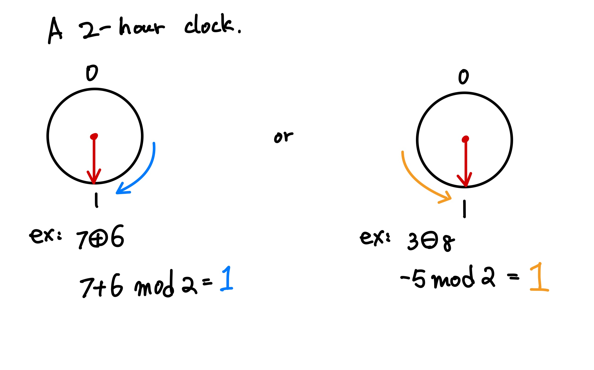

# Modular 

$$ a \equiv b \;(mod\; m) $$ where a and b are integers, and m is a natual numebr $N$

# Examples
Let's loko into 1st examples: 
$$ 10 \equiv 4 \;(mod\; 6) $$
can be intrepreted as 10 - 4 is divisible by 6,

$$ 28 \equiv 4 \;(mod\; 6) $$
can be intrepreted as 28 - 4 is divisible by 6,

$$ 36 \equiv 0 \;(mod\; 6) $$
can be intrepreted as 36 - 4 is divisible by 6.

We can see that two different numbers can be represented as congruent in mod 6. **Notice above that both 10 and 28 are congruent to 4 in mod 6.**

# Moduler 2 

    
    

        Moduler 2 arithemtic example
    

# Congruence

# Addition

# Multiplication

# Exponentiation

# Division

# Multiplicative Inverses