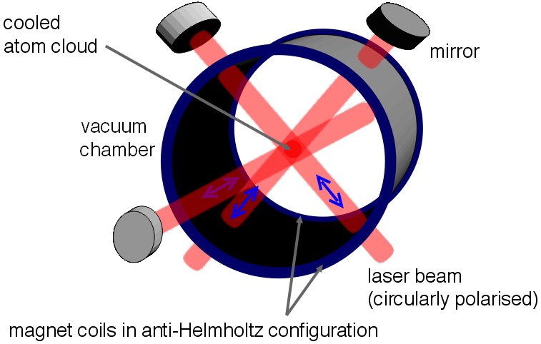
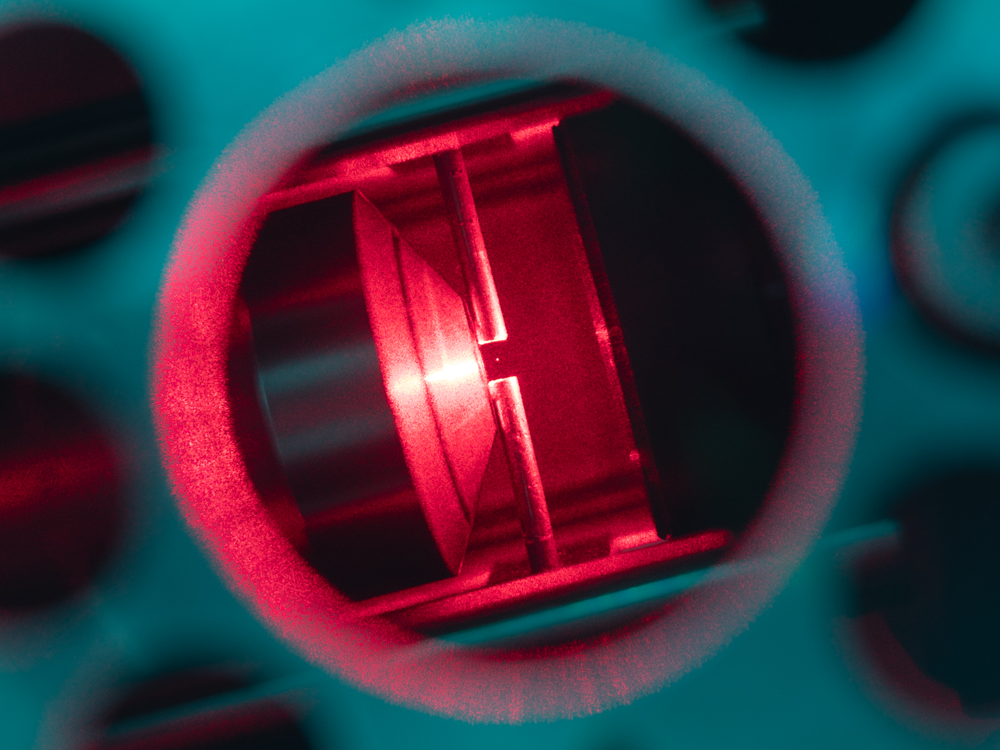
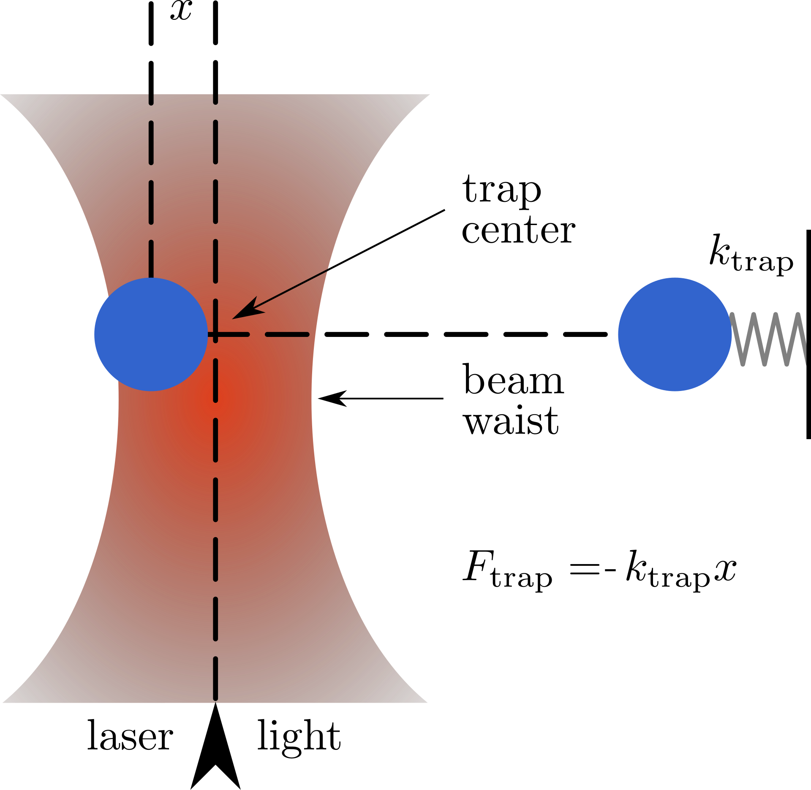

# Neutral atom quantum computer

!!! Tip "Quick overview"
    -   Qubit: [Hyperfine states (structure)](https://en.wikipedia.org/wiki/Hyperfine_structure)
    -   Qubit initialization: optical pumping
    -   Entanglement: Rydberg blockade
    -   Gate: Laser
    -   Industry: [QuEra Computing Inc.](https://www.quera.com/)
    -   Glossary (Q & A): [see here!](#q-and-a)
    -   Basic idea: Using polarized laser  light to create a controlled electromagnetic field that interacts with a neutral atom.

## Introduction
A Neutral atom quantum computer is a new type of quantum computer which is made by [*Rydberg atoms*](#what-is-rydberg-atom "A Rydberg atom is an excited atom with one or more electrons that have a very high principal quantum number, n") . It utailzes technologies such as [*laser cooling*](#what-is-laser-cooling "Laser cooling includes several techniques where atoms, molecules, and small mechanical systems are cooled with laser light."), [*magneto-optical trapping (MOT)*](#what-is-magneto-optical-trapping "In atomic, molecular, and optical physics, a magneto-optical trap (MOT) is an apparatus which uses laser cooling and a spatially varying magnetic field to create a trap which can produce samples of cold neutral atoms. ") and [*optical tweezers*](#what-is-optical-tweezers "Optical tweezers (originally called single-beam gradient force trap) are scientific instruments that use a highly focused laser beam to hold and move microscopic and sub-microscopic objects like atoms, nanoparticles and droplets, in a manner similar to tweezers."). To perfrom computation, the atoms are first trapped in a [*magneto-optical trapping (MOT)*](#what-is-magneto-optical-trapping "In atomic, molecular, and optical physics, a magneto-optical trap (MOT) is an apparatus which uses laser cooling and a spatially varying magnetic field to create a trap which can produce samples of cold neutral atoms. "). Qubits are then encoded in the energy level of the atoms. By manipulate laser on qubits, we can accomplish actions such as initialization and operations. The laser can accomplish arbitrary single qubi gates and a `CZ` gate for *universal quantum gates*. Measurement is enforced at the end of the computation with a camera that generates an image of the outcome by measueing the fluorescence of the atoms.

## Architecture
One of the architecture [[1]](../quantum_computation/q_computer_neutral_atom.md#references), an array of atoms is loaded into a laser cooled at micro-kelvin temperatures. In each of these atoms, two levels of [*hyperfine*](#what-is-hyperfine-structure "Hyperfine structure is the tiny splitting of atomic energy levels caused by interactions between the nucleus and electrons.") ground subspace are isolated. The qubits are prepared in some initial state using *optical pumping*. Logic gates are performed using optical or microwave frequency fields and the measurements are done using [*resonance fluorescence*](#what-is-resonance-fluorescence "Resonance fluorescence is the light emitted by an atom (or molecule) when it is excited by light at a frequency resonant with one of its internal transitions, and then re-emits a photon as it decays back to the same ground state."). 

>   Common atoms types: rubidium(Ru)[[4]](#ref-rubidium), caesium(Cs), ytterbium(Yb), and strontium(Sr) atoms.

## Single qubit gates
Global single qubit gates on all the atoms can be done either by applying a microwave field for qubits encoded in the [*hyperfine*](#what-is-hyperfine-structure "Hyperfine structure is the tiny splitting of atomic energy levels caused by interactions between the nucleus and electrons.") such as Rb and Cs or by applying an RF magnetic field for qubits encoded in the nuclear spin such as Yb and Sr. Focused laser beams can be used to do single-site one qubit rotation using a lambda-type three level Raman scheme (see figure). In this scheme, the rotation between the qubit states is mediated by an intermediate excited state. Single qubit gate *fidelities* have been shown to be as high as .999 in state-of-the-art experiments.

## Entangling gate 
The first fast gate based on Rydberg states was proposed for charged atoms making use of the principle of Rydberg Blockade. The principle was later transferred and developed further for neutral atoms [[2]](../quantum_computation/q_computer_neutral_atom.md#references).

## Rydberg mediated gate
Atoms that have been excited to very large principal quantum number $n$ are known as Rydberg atoms. These highly excited atoms have several desirable properties including high decay lift-time and amplified couplings with electromagnetic fields.

> The basic principle for Rydberg mediated gates is called the Rydberg blockade[[3]]

Consider two neutral atoms in their respective ground states. When they close to each other, their interaction potential is dominated by van Der Waals force $V_{qq} \approx \frac{\mu_{B}^{2}}{R^{6}}$ where $\mu_{B}$ is the Bohr Magneton and $R$ is the distance between the atoms. This interaction is very weak, around $10^{-5}$ Hz for $R=10\mu m$. When one of the atoms is put into a Rydberg state (again, a state that has very principle quantum number $n$), the interaction between the two atoms is dominated by second order [dipole-dipole interaction (LibreTests Chemistry)](https://chem.libretexts.org/Bookshelves/Physical_and_Theoretical_Chemistry_Textbook_Maps/Supplemental_Modules_(Physical_and_Theoretical_Chemistry)/Physical_Properties_of_Matter/Atomic_and_Molecular_Properties/Intermolecular_Forces/Specific_Interactions/Dipole-Dipole_Interactions) which is also weak. When both of the atoms are excited to a Rydberg state, then the resonant dipole-dipole interaction becomes $V_{rr} = \frac{(n^{2}ea_{0})^{2}}{R^{3}}$ where $a_{0}$ is the Bohr radius. This interaction is around 100MHz at $R = 10 \mu m$, around twelve orders of mafnitude larger. This interaction potential induces a blockade, where-in, ==if one atom is excited to a Rydberg state, the other nearby atoms cannot be excited to a Rydberg state because the two-atom Rydberg state is far detuned.== This phenomenon is called the Rydberg blockade. Rydberg mediated gates make use of this blockade as a control mechanism to implement two qubit controlled gates.

## Rydberg blockade
Suppose we are considering two isolated neutral atoms in a magneto-optical trap. Ignoring the coupling of hyperfine levels that make the qubit and motional degrees of freedom, the Hamiltonian of this system can be written as:

$$
H = H_{1} + H_{2} + V_{rr}|r\rangle_{1}\langle r|\otimes |r\rangle_{2}\langle r|
$$

, where $H_{i} = \frac{1}{2}(\Omega |1\rangle_{1}\langle r| + \Omega^{*} |r\angle_{r}\langle 1|) - \Delta|r\rangle_{i}\langle r|$ is the Hamiltonian of $i$-th atom, $\Omega$ is the Rabi frequency of coupling between the Rydberg states and the $|1\rangle$ state and $\Delta$ is the [*detuning*](#what-is-detuning "Detuning refers to how far the laser frequency is odd from resonance with an atomic transition."). ==Where $|V_{rr} >> |\Omega|, \ |\Delta|$, we are in the so-called Rydberg Blockade regime.== The physics of this Hamiltonian can be divided into several subspaces depending on the initial state. The $|00\rangle$ state is [*decoupled*](#what-is-decoupling "Reducing or eliminating the interaction between the qubit and its environment or between different quantum systems") and does not evolve. Suppose only one of the atom is in $|1\rangle$ state, i.e.,($|01\rangle$ or $|10\rangle$), then the Hamiltonian is given by $H_i$. This Hamiltonian is the standard two-level [Rabi](https://en.wikipedia.org/wiki/Rabi_cycle) hamiltonian. it characterizes the "light shift" in a two level system and has eigenvalues $E_{LS}^{(1)} = \frac{1}{2}(\Delta \pm \sqrt{\Omega^{2} + \Delta^{2}})$. 

If both atoms are in the exctied state $|11\rangle$, the effective system evolves in the subspace of $\{|1r\rangle, |r1\rangle,|11\rangle|\}$. We define the bright and dark basic states as $|b\rangle = \frac{1}{\sqrt{2}}(|r1\rangle + |1r\rangle)$ and $|d\rangle = \frac{1}{\sqrt{2}}(|r1\rangle - |1r\rangle)$, respectively, along with state $|11\rangle$, we have the Hamiltonian 

$$
H = -\Delta(|b\rangle\langle b|+|d\rangle\langle d|) + \frac{\sqrt{2}}{2}(\Omega|b\rangle\langle11| + \Omega^{*}|11\rangle\langle b|).
$$

note that the dark state is decoupled from the bright state and the $|11\rangle$. Thus we can ignore it and the effective evolution reduces to a two-level system consisting of the bright state and $|11\rangle$. In this basis, the dressed eigenvalues and eigenvectors of the Hamiltonian are given by:

$$
\begin{array}{c}
E_{LS}^{(2)} = \frac{1}{2}(\Delta \pm \sqrt{2\Omega^{2}+\Delta^{2}})\\
|\widetilde{11}\rangle = \text{cos}(\theta/2)|11\rangle  + \text{sin}(\theta/2)|b\rangle\\
|\widetilde{b}\rangle = \text{cos}(\theta/2)|b\rangle  + \text{sin}(\theta/2)|11\rangle
\end{array}
$$

where $\theta$ depends on the **Rabi frequency** and **detuning**. 

## Controll-phase gate

## Q and A

!!! Question "What is Rydberg atoms?"
    1.  What is a Rydberg Atom?

        -   A Rydberg atom is an excited atom with one or more electrons that have a very high principal quantum number, $n$.
        -   High principle quantum number makes an atom becomes huge (can go to micrometer scale).
        -   The higher the value of n, the farther the electron is from the nucleus, on average. 
        -   Exaggerated response to eletric and magnetic fields.
        -   Long decay periods and electron wavefunctions that approximate, under some conditions, classical orbits of electrons about the nuclei.
        -   The core electrons shield the outer electron from the electric field of the nucleus such that, from a distance, the electric potential looks identical to that experienced by the electron in a hydrogen atom. 
        -   It behaves hydrogen-like due to shielding by inner electrons.

        >   Imagine the nucleus is a bright lamp, and the core electrons are layers of curtains. If you stand far enough away, the curtains diffuse the light so it seems like you're looking at a single dim bulb, not the intense original light.

    2.  What makes Rydberg Atoms special for Quantunm computing? 
        -   Strong dipole–dipole / van der Waals interaction: enables fast two-qubit entangling gates.
        -   Rydberg Blockade: guarantees clean, high-fidelity logic gates by preventing simultaneous excitation nearby.
        -   Laser control: lasers can excite/de-excite states on-demand.

    3.  How do we create a Rydberg atom?
        1.  Start with a neutral atom
        2.  Using Magneto-optical traps or optical tweezers to isolate and trap single atoms at microkelvin temperatures.
        3.  Use lasers to excite the electron.

        >   You're just using light (photons) to move one electron into a Rydberg state.

    More, see: [Raydberg atoms (wiki)](https://en.wikipedia.org/wiki/Rydberg_atom) and paper [[4]](#ref-rubidium)

!!! Question "What is Laser cooling?"
    Laser cooling is a technique used to slow down and cool atoms using laser light — often reaching microkelvin or even nanokelvin temperatures. Despite using lasers (which sound "hot"), the process reduces the atom’s kinetic energy.

    -   The laser light hit atoms opposite to their direction to make them slow down.
    -   Repeated absorption and emission also slow them down.

    How does it work? 

    -   Doppler Effect: The atom sees a laser as "blue-shifted" when moving toward it. So, it preferentially absorbs photons from lasers aimed against its motion.
    -   Every absorbed photon pushes the atom a tiny bit backwards. Repeating this slows it.
    -   Spontaneous Emission: The atom re-emits the photon in a random direction, averaging out to zero net push over time.

!!! Question "What is magneto-optical trapping?"
    In atomic, molecular, and optical physics, a magneto-optical trap (MOT) is an apparatus which uses laser cooling and a spatially varying magnetic field to create a trap which can produce samples of cold neutral atoms. Temperatures achieved in a MOT can be as low as several microkelvins, depending on the atomic species, which is two or three times below the photon-recoil limit.

    

        
        

            Experimental setup of the MOT [[8].Jan Krieger](#MOT_setup)
        

    

    More, see: [MOT(wiki)](https://en.wikipedia.org/wiki/Magneto-optical_trap)

!!! Question "What is optical tweezers?"
    Optical tweezers use a tightly focused laser beam to trap and manipulate small particles (like atoms or cells). The laser’s electric field gradient exerts a force on the particle, pulling it toward the region of highest intensity — typically the laser focus point. If the particle has a higher refractive index than its surrounding, it’s pulled toward the laser focus. If lower, it’s pushed away.

    

        
        

            A photograph of a nanoparticle \( 103 nm \) trapped by an optical tweezer [[5].Bjschellenberg](#partical-trapped-by-an-optical-tweezer)
        

    

    

        
        

            Dielectric objects are attracted to the center of the beam, slightly above the beam waist, as described in the text. The force applied on the object depends linearly on its displacement from the trap center just as with a simple spring system. [[6].Cr4sZz](#Optical_trap_principle_formula_edit)
        

    

    > It's just like a ball attached to invisible springy strings pulling it toward the laser focus point. The laser creates a potential well, and the particle oscillates like it's in a tiny spring-loaded bowl.    

    More, see: [optical tweezers (wiki)](https://en.wikipedia.org/wiki/Optical_tweezers) 

!!! Question "What is Hyperfine Structure?"
    Hyperfine structure is the tiny splitting of atomic energy levels caused by interactions between the nucleus and electrons.

    -   Energy levles: Energy level is defined by the electron configuration and principal quantum number $n$.
    
        >  Main Level (e.g. 5s, 5p) $\rightarrow$ Fine Structure (spin-orbit) $\rightarrow$ Hyperfine Structure (nuclear spin)

        
    -   Fine structure: Each electronic level splits due to spin–orbit coupling:

    -   Hyperfine structure: Each fine-structure level further splits due to interaction with the nuclear spin

    

        
        

            Schematic illustration of fine and hyperfine structure in a neutral hydrogen atom. [[9].DJIndica](#Hyperfine_state)
        

    

    More, see: [Hyperfine structure (wiki)](https://en.wikipedia.org/wiki/Hyperfine_structure)

!!! Question "What is optical pumping?"
    Optical pumping uses laser light to “pump” atoms from one state to another, often to prepare them in a specific quantum state like $|0\rangle$

    How it works:

    1.  Atoms start in a mix of quantum states
    2.  A laser beam, tuned to a specific transition and with a specific polarization, excites only certain states.
    3.  Atoms absorb light and jump to an excited state, then spontaneously emit and fall back down — but not always to the same state.
    4.  After many cycles, most atoms end up in a "dark state" that doesn’t absorb the laser anymore.

    >   Optical pumping is used to initialize atoms into a specific hyperfine ground state (e.g., $|F=1,m_{F}\rangle = |0\rangle$ or $|F=2,m_{F}\rangle = |1\rangle$) by selectively driving transitions using polarized laser light, allowing population transfer to a dark state (the state which doesnt absorb the laser anymore.). 

    More, see: [Optical pumping (wiki)](https://en.wikipedia.org/wiki/Optical_pumping)

!!! Question "What is resonance fluorescence?"
    Resonance fluorescence is the light emitted by an atom (or molecule) when it is excited by light at a frequency resonant with one of its internal transitions, and then re-emits a photon as it decays back to the same ground state.
    
    1.  A laser tuned to match an atomic transition excites the atom.
    2.  The atom absorbs the photon and transitions to an excited state.
    3.  It spontaneously emits a photon and drops back to the same ground state.
    4.  This cycle repeats, resulting in steady emission of light at or near the laser frequency.

    For example, if we have a state $|\psi\rangle = \alpha |0\rangle + \beta|1\rangle$. You shine resooant laser light that interacts only with one of the state, $|1\rangle$ for example. We then have two possibilities:

    *   If the atom is in state $|1\rangle$, it **scatter photons** and you see resonance fluorescence then we know its at state $|1\rangle$.
    *   On the other hand, if you see no scattering, we can interpret it as measured $|0\rangle$.

    More, see: [Resonance fluorescence (wiki)](https://en.wikipedia.org/wiki/Resonance_fluorescence)

!!! Question "What is decouple?"
    Decoupling means reducing or eliminating the interaction between the qubit and its environment or between different quantum systems

!!! Question "What is Rabi Frequency"
    The Rabi frequency $\Omega$ is the rate at which a two-level quantum system coherently oscillates between its two states when driven by a resonant external field (laser in our case). 

    $$
    \Omega = \frac{\mu E}{ \hbar}
    $$

    where $\mu$ is the transition's dipole moment, $E$ is the field's eletrci-field amplitude, and $\hbar$ is Plank's constant over $2\pi$.

    *   A $\pi$-pulse of duration $t = \pi/\Omega$ implements an $X$-gate $(|0\rangle \mapsto |1\rangle)$.
    *   A $\pi/2$-pulse of duration $t = \pi/(2 \Omega)$ implements an $X$-gate $(|0\rangle \mapsto (|0\rangle+|1\rangle)/\sqrt{2})$.

    Trade off:
        
    *   **Higher Ω**: A shorter $\pi$-pulse yields a faster X-gate, reducing exposure to decoherence. However, boosting Ω requires higher laser power, which can induce unwanted transitions (crosstalk) or shift energy levels (AC Stark shifts), harming gate fidelity.
    *   **Lower Ω**: Longer gate times allow environmental noise to degrade your qubit.

    >   The Rabi frequency is literally your gate speed—it tells you how fast you can rotate a qubit from $|0\rangle$ to $|1\rangle$ (or anywhere in between). 

    More, see [Raby frequency (wiki)](https://en.wikipedia.org/wiki/Rabi_cycle)

!!! Question "What is Detuning?"
    Detuning refers to how far the laser frequency is odd from resonance with an atomic transition.

    $$
    \Delta = \omega_{\text{laser}} - \omega_{\text{atom}}
    $$

    where $\Delta = 0$ means you are on resonance, and $\Delta \neq 0$ means you're detuned.
    

!!! Question "What is spinning in the Neutral atom computer setup?"
    The quantum spinor state of the atom — the probability amplitude of being in spin-up vs spin-down ($|0\rangle$ vs $|1\rangle$) — that's "rotating" in an abstract Hilbert space.

    When we apply a pulse (using light or microwaves), we rotate the qubit’s quantum state vector — meaning we change the probability amplitude and phase between $|0\rangle$ and $|1\rangle$. This rotation happens on an abstract Bloch sphere and corresponds to a unitary gate.

    >   We are not spinning the atom, but rotating its internal quantum state in Hilbert space, driven by electromagnetic interaction with the laser.

!!! Question "Why is a neutral atom conisdered a quantum system?" 
    Even a nertral atom is made of many particles (protons, neutrons, electrons), it stil behaves quatnum mechanically when we isolate and manipulate its internal degree of freedom:

    1.  Energy level (hyperfine structure)
    2.  Spin states (total angular momentum)
    3.  Coherence between those states

    These states are quantized, live in a well-defined Hilbert space, and can be manipulated and measured in ways that follow quantum mechanics.

    In sum, we use neutral atom as a qubit since it follows the following rules of quantum mechanics:

    1.  They form a two-dimensional Hilbert space.
    2.  They support superposition and interference.
    3.  They respond to unitary gate operations.
    4.  They exhibit collapse upon measurement.

## References 

[1].    Quantum computing with atomic qubits and Rydberg interactions: Progress and challenges, M. Saffman, arxiv: https://arxiv.org/abs/1605.05207[https://arxiv.org/abs/1605.05207](https://arxiv.org/abs/1605.05207)

[2].    Jaksch, D.; Cirac, J. I.; Zoller, P.; Rolston, S. L.; Côté, R.; Lukin, M. D. (4 September 2000). "Fast Quantum Gates for Neutral Atoms". [https://arxiv.org/abs/quant-ph/0004038](https://arxiv.org/abs/quant-ph/0004038)

[3].    Walker, Thad G.; Saffman, Mark (1 July 2012). "Chapter 2 - Entanglement of Two Atoms Using Rydberg Blockade". Advances in Atomic, Molecular, and Optical Physics. 61. Academic Press: 81–115. [arXiv:1202.5328](https://arxiv.org/abs/1202.5328)

[4].    Evered, Simon J.; Bluvstein, Dolev; Kalinowski, Marcin; Ebadi, Sepehr; Manovitz, Tom; Zhou, Hengyun; Li, Sophie H.; Geim, Alexandra A.; Wang, Tout T.; Maskara, Nishad; Levine, Harry; Semeghini, Giulia; Greiner, Markus; Vuletić, Vladan; Lukin, Mikhail D. (October 2023). Nature. 622 (7982): 268–272. [https://arxiv.org/abs/2304.05420](https://arxiv.org/abs/2304.05420)

[5].    By <a href="//commons.wikimedia.org/w/index.php?title=User:Bjschellenberg&amp;action=edit&amp;redlink=1" class="new" title="User:Bjschellenberg (page does not exist)">Bjschellenberg</a> - <a rel="nofollow" class="external free" href="https://stevenhoekstra.owlstown.net/projects/426-levitated-nanospheres">https://stevenhoekstra.owlstown.net/projects/426-levitated-nanospheres</a> (see <a href="//doi.org/10.1063/5.0166136" class="extiw" title="doi:10.1063/5.0166136">doi:10.1063/5.0166136</a> that is CC-BY and has this image as issue-cover, with first-author matching uploader's username), <a href="https://creativecommons.org/licenses/by-sa/4.0" title="Creative Commons Attribution-Share Alike 4.0">CC BY-SA 4.0</a>, <a href="https://commons.wikimedia.org/w/index.php?curid=137390829">Link</a>

[6].    By <a href="//commons.wikimedia.org/w/index.php?title=User:Cr4sZz&amp;action=edit&amp;redlink=1" class="new" title="User:Cr4sZz (page does not exist)">Cr4sZz</a> - Own work, <a href="https://creativecommons.org/licenses/by-sa/4.0" title="Creative Commons Attribution-Share Alike 4.0">CC BY-SA 4.0</a>, <a href="https://commons.wikimedia.org/w/index.php?curid=87073242">Link</a>

[7].    Public Domain, <a href="https://commons.wikimedia.org/w/index.php?curid=2434867">Link</a>

[8].   By Jan Krieger, translated into English by User:Dumbledore - This file was derived from: <a href="//commons.wikimedia.org/wiki/File:Mot_aufbau.png" title="File:Mot aufbau.png">Mot aufbau.png</a>, Public Domain, <a href="https://commons.wikimedia.org/w/index.php?curid=19227419">Link</a>

[9.]    By Original: <a href="//commons.wikimedia.org/wiki/User:DJIndica" title="User:DJIndica">DJIndica</a> Vector: Edudobay - Own work based on: <a href="//commons.wikimedia.org/wiki/File:Fine_hyperfine_levels.png" title="File:Fine hyperfine levels.png">Fine hyperfine levels.png</a>&nbsp;by <a href="//commons.wikimedia.org/wiki/User:DJIndica" title="User:DJIndica">DJIndica</a>, Public Domain, <a href="https://commons.wikimedia.org/w/index.php?curid=10353148">Link</a>

[x].    Neutral atom quantum computer (wiki):[https://en.wikipedia.org/wiki/Neutral_atom_quantum_computer](https://en.wikipedia.org/wiki/Neutral_atom_quantum_computer)

[x].    Rydberg atom (wiki): [https://en.wikipedia.org/wiki/Rydberg_atom](https://en.wikipedia.org/wiki/Rydberg_atom)

