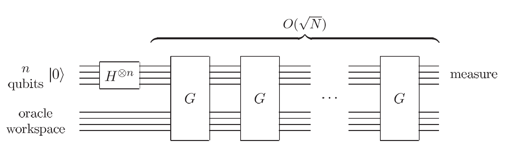
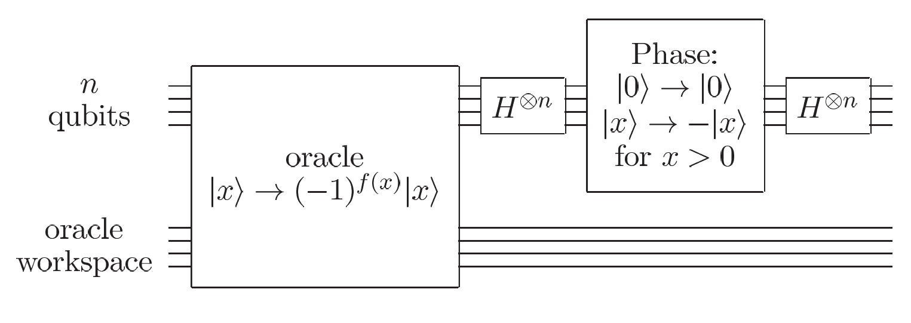
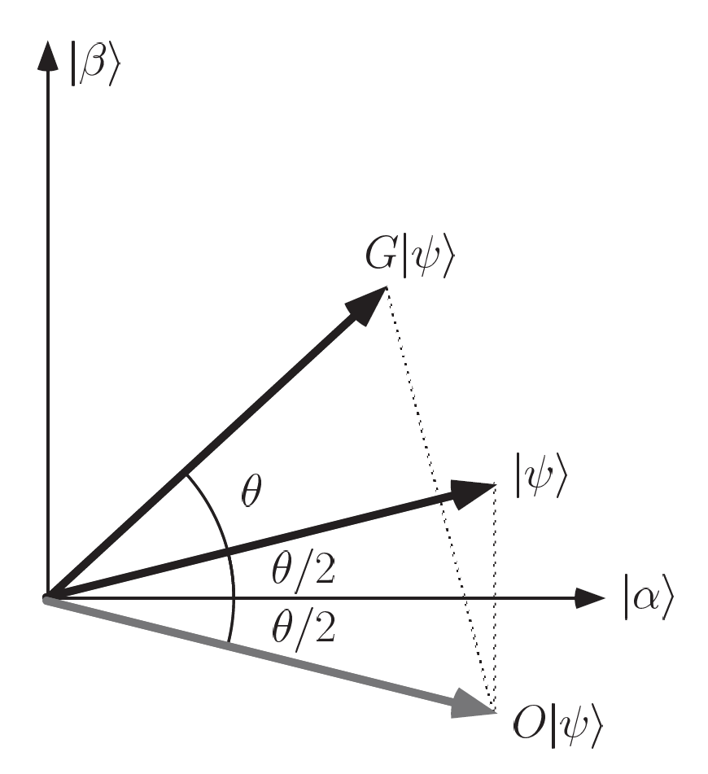

# The Quantum Search Algorithm

## The Orcale

Suppose we wish to search through a search space of $N$ elements. Rather than search the elementes directly, we focus on the *index* to those elements, which is just a number in the range $0$ to $N-1$. For convenience we assume $N = 2^n$, so the index can be stored in $n$ bits, and that the search problem has exactly $M$ solutions, with $1 \leq M \leq N$. This can be represented by a function $f$, which takes as inpur an integer $x$, in the range $0$ to $N-1$. By definition, 

$$
f(x) = 
\begin{cases}
1 & \text{if } x \ \text{is a solution to the search problem} \\
0  & \text{if } x \ \text{is not a solution to the search problem}
\end{cases}
$$

!!! example
    For example, we have a search problem that has $N = 2^{3}$ elements, and a problem has $M = 2$ solutions of our interests, which meets the requiremnet $1 \leq M \leq N$. Then we encode our problem, by preparing $|x\rangle|0\rangle$, into a quantum circuit and run the oracle $\mathcal{O}$ and obtain solution $f(x = 2) = f(x = 4) = 1$.

Suppose we are supplied with a quantum *oracle* - a black box - with the ability to *recognize* solutions to the search problem. This recognition is signalled by making use of an *orcale qubit*. 

The orcale is a unitary operator, $O$, defined by its action on the computational basis:

$$
|x\rangle|q\rangle \xrightarrow{\mathcal{O}} |x\rangle|q \oplus f(x)\rangle,
$$

where $|x\rangle$ is the index register, $\oplus$ denotes addition modulo 2, and the orcale qubit $|q\rangle$ is a single qubit which is flipped if $f(x)=1$, and is unchanged otherwise.

In the quantum search algorithm it is useful to apply the orcal with the oracle qubit initially in the state $\frac{|0\rangle - |1\rangle}{\sqrt{2}}$, just as was donw in the Deutsch-Jozsa algorithm. If $x$ is not a solution to the search problem, applying the oracle to the state $|x\rangle\frac{|0\rangle - |1\rangle}{\sqrt{2}}$ doesn't change the state. On the other hand, if $x$ is a solution to the seach problem, then $|0\rangle$ and $|1\rangle$ are interchanged by the action of the oracle, giving the final state $-|x\rangle\frac{|0\rangle - |1\rangle}{\sqrt{2}}$. The action of the oracle is thus:

$$
|x\rangle\bigg(\frac{|0\rangle - |1\rangle}{\sqrt{2}} \bigg) \xrightarrow{\mathcal{O}} (-1)^{f(x)} |x\rangle\bigg(\frac{|0\rangle - |1\rangle}{\sqrt{2}} \bigg),
$$

where you can easily see that if solution, term becomes $-|x\rangle\bigg(\frac{|0\rangle - |1\rangle}{\sqrt{2}} \bigg)$. Notice that the state of the oracle qubit is not changed and can therefore be omitted from further discussion of the algorithm. Thus, for simplicity, we write:

$$
|x\rangle \xrightarrow{\mathcal{O}} (-1)^{f(x)}|x\rangle.
$$

We say that the oracle *marks* the solutions to the search problem, by shifting the phase of the solution. For an $N$ item search problem with $M$ solutions, it turns out that we need only apply the search oracle $O(\sqrt{N/M})$ times to obtain a solution on a quantum computer.

## The procedure 

The internal working of the oracle, including the possibility of it needing extra work qubits, are not important to the description of the quantum search algorithm proper. The goal of the algorithm is to find a solution to the search problem, using the smallest possible number of applications of the orcale. 

The algorithm begines with the computer in the state $|0\rangle^{\otimes n}$. The `H` gate is used to put the computer in the equal superposition state,

$$
|\psi\rangle = \frac{1}{N^{1/2}}\sum_{x=0}^{N-1}|x\rangle.
$$

or 

$$
|0\rangle^{\otimes n} \xrightarrow{H^{\otimes n}} \frac{1}{\sqrt{2^{n}}}\sum_{x=0}^{2^{n}-1}|x\rangle.
$$

> Quantum computing exploits quantum parallelism — the ability to evaluate a function on many inputs simultaneously using superposition. And that's why we put qubits in an equal superposition.

The quantum search algorithm then consists of repeated application of a quantum subroutine, known as a *Grover operator*, which we denote $G$. The Grover iteration may broken up into four steps.

1.  Apply the oracle $O$.
2.  Apply the `H` transform $H^{\otimes n}$.
3.  perform a conditional phase shift on the computer, with every computational basis state except $|0\rangle$ receiving a phase shift of $-1$,

    $$
    |x\rangle \rightarrow -(-1)^{\delta_{x}0}|s\rangle.
    $$

4.  Apply the `H` transform $H^{\otimes n}$. 

### Implmentation on Quantum computer 

    
    

        Schematic circuit for the quantum search algorithm.
    

    
    

        Circuit for the Grover iteration, \( G \).
    

Each of the operations in the Groveer iteration can be efficiently implemneted on a quantum computer. The `H` in step 2 and 4 require $n = log{N}$ operations each. The conditional phase in step 3 can be implemented using $O(n)$ gates. The cost of the oracle call depends upon the specific application. The combined effect of step 2,3, and 4 is 

$$
H^{\otimes n} (2|0\rangle\langle 0| - I)H^{\otimes n} = 2|\psi\rangle\langle\psi| - I,
$$

where $|\psi\rangle$ is the equally weighted superspoition of state 

$$
|\psi\rangle = \frac{1}{N^{1/2}}\sum_{x=0}^{N-1}|x\rangle.
$$

Thus we denote the Grover iteration, $G$, can be written as 

$$
G = (2|\psi\rangle\langle\psi|)O.
$$

## Geometric visualization

The Grover iteration, $G = (2|\psi\rangle\langle\psi|)O$, can be seen as a rotation in the two=dimensional space spanned by the starting vector $|\psi\rangle$ and the state consisting of a uniform superposition of solutions to the search problem. Let's define $\sum_{x}^{'}$ as a sum over all $x$ which are solutions to the problem, and $\sum_{x}^{''}$ in dicates a sum over all $x$ which are not solutions to the search problem. Define normalized states

$$
\begin{array}{l}
|\alpha\rangle \equiv \frac{1}{\sqrt{N-M}}\sum_{x}^{''}|x\rangle \\
|\beta\rangle \equiv \frac{1}{\sqrt{M}}\sum_{x}^{'}|x\rangle
\end{array}
$$

We must know that the initial state $|\psi\rangle$ may be re-expressed as 

$$
|\psi\rangle = \sqrt{\frac{N-M}{N}}|\alpha\rangle + \sqrt{\frac{M}{N}}|\beta\rangle,
$$

so the initial state of the quantum computer is in the space ==spanned by $|\alpha\rangle$ and $|\beta\rangle$.==

The effect of $G$ can be understood as following:

1.  Operation $O$ performs a *reflection* about the vector $|\alpha$ in the plane defined by $|\alpha\rangle$ and $|\beta\rangle$. 

2.  $2|\psi\rangle\langle \psi| - I$ performs a reflection in the plane defined by $|\alpha$ and $|\beta\rangle$, about the vector $|\psi\rangle$. And the product of two reflections is a rotation!.

3.  The state $G^{k}|\psi\rangle$ remains in the space spanned by $|\alpha\rangle$ and $|\beta\rangle$ for all $k$ and it also tells us the rotation angle. Let's set 

    $$
    \begin{array}{l}
    \text{cos}\frac{\theta}{2} = \sqrt{\frac{N-M}{N}}\\
    \text{sin}\frac{\theta}{2} = \sqrt{\frac{M}{N}}
    \end{array}
    $$
    
    thus, $|\psi\rangle = \text{cos}{\theta}{2}|\alpha\rangle + \text{sin}{\theta}{2}|\beta\rangle$.

As image shows below, the two reflections which comprise $G$ take $|\psi\rangle$ to 

$$
G|\psi\rangle = \text{cos}\frac{3\theta}{2}|\alpha\rangle + \text{sin}\frac{3\theta}{2}|\beta\rangle,
$$

so the rotation angle is in fact $\theta$. It follow that continued application of $G$ takes the state to 

$$
G^{k}|\psi\rangle = \text{cos} \bigg(\frac{2k+1}{2}\theta \bigg) |\alpha\rangle + \text{sin}\bigg(\frac{2k+1}{2}\theta \bigg) |\beta\rangle.
$$

    
    

        The action of single Grover iteration, \( G \). The sate vector \( |\psi\rangle \) is rotated by \( \theta \) towards the superposition \( \beta \) of all solutions to the search problem. 1. The state vector \( |\psi\rangle \) is positioned at angle of \( \theta/2 \) from \( |\alpha\rangle \). 2. The oracle \( O \) reflects the state vector about the state \( |\alpha\rangle \). 3., the opeartor \( 2|\psi\rangle\langle \psi| -I \) reflects it about \( |\psi\rangle \). After repeated Grover iteration, the state vector gets close to \( |\beta\rangle \), at which point an observation in the computational basis outputs a solution to the search problem with high probability.
    

> Only $O\sqrt{N/M}$ applications of $G$ are required to rotate the state vector close to $|\beta\rangle$.

In sum, $G$ is a rotation in the two-dimensional space spanned by $|\alpha\rangle$ and $|\beta\rangle$, rotating the sapce by $\theta$ radians per application of $G$. 

> Repeated application of the computational basis produces with high probability one of the outcomes superposed in $|\beta\rangle$, that is, a solution to the search problem!

!!! Example

## Performance
The question is: how many times must the Grover iteration be repeated to rotate $|\psi\rangle$ near $|\beta\rangle$? The initial state $|\psi\rangle = \sqrt{\frac{N-M}{N}}|\alpha\rangle + \sqrt{\frac{M}{N}}|\beta\rangle$, so rotating through across $\sqrt{M/N}$ radians takes the system to $|\beta\rangle$. Let $\text{CI}{x}$ denote the integer closest to the real number $x$, where by convention we round halves down, $\text{CI}(3.5) = 3$, for example. Then repeating the Grover iteration

$$
R = \text{CI}\bigg(\frac{\text{cos}^{-1}\sqrt{M/N}}{\theta} \bigg)
$$

times rotates $|\psi\rangle$ to within an angle $\theta/2 \leq \pi/4$ of $|\beta\rangle$. For 

> This means you only have to let the state rotates to within 45 degrees of vector $|\beta\rangle$ and we will have high probability to get the solution when measure.

If $M\leq N/2$, and we know that a lower bound on $\theta$ will give an upper bound on $R:

$$
\frac{\theta}{2} \geq \text{sin}\frac{\theta}{2} = \sqrt{\frac{M}{N}} \Rightarrow \theta \geq 2 \sqrt{\frac{M}{N}}
$$

then:

$$
R \leq \lceil\frac{\pi}{2\theta} \rceil \leq \lceil \frac{\pi}{4}\sqrt{\frac{N}{M}} \rceil
$$

This gives 

$$
R = O(\sqrt{N/M})
$$

> We need only $O(\sqrt{N/M})$ oracle calls

## References 

[1]. M. A. Nielsen and I. L. Chuang, *Quantum Computation and Quantum Information*, 10th Anniversary Ed., Cambridge: Cambridge University Press, 2010.