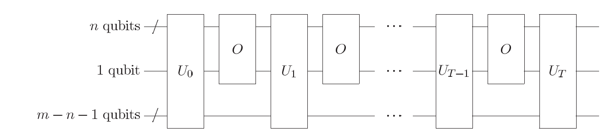

# Black box algorithm limits 

In this section, we will discuss for a given $F$, a Boolean function, how fast (measured in number of queries) can a classical and quantum computer compte these functions given an oracle for $f$? 

You may think its difficult to answer this question without knowing something about the function $f$, but in face a great deal can be determined even in thie "black box" model, where the mean by which the oracle accomplished its task is taken for granted, and complexity is measured only in terms of the number of required oracle queries.

## Method of polynomials

Let's start with some useful definitions:

*   **$D(F)$**: Deterministic query complexity: Minimum number of oracle calls a classical algorithm needs to compute $F$ with certainty.

*   **$Q_E(F)$**: Exact quantum query complexity: Minimum number of oracle calls a quantum algorithm needs to compute $F$ with 100% accuracy.

*   **$Q_2(F)$**: Bounded-error quantum query complexity: Minimum number of queries for a quantum algorithm to get the correct result with probability $\geq \frac{2}{3}$, where $\frac{2}{3}$ is an arbitrary number, the probability need only be bounded finitely away from $\frac{1}{2}$ to be boosted close to $1$ by repetitions.

*   **$Q_0(F)$**: Zero-error quantum query complexity: The output is either correct or "I don't know" (inconclusive), but never wrong.

These complexities satisfy the relation:

$$
Q_2(F) \leq Q_0(F) \leq Q_E(F) \leq D(F) \leq N
$$

We can represent any Boolean function $F(X)$ using a real-valued multilinear polynomial $p(X)$, where each input variable $X_k \in \{0,1\}$.

The polynomial is defined as:

$$
p(X) = \sum_{Y \in \{0,1\}^N} F(Y) \prod_{k=0}^{N-1} \left[1 - (Y_k - X_k)^2 \right]
$$

-   Each $X_k$ is binary, so $X_k^2 = X_k$. This ensures the polynomial is multilinear.
-   For a given $Y$, the product $\prod_{k}(1 - (Y_k - X_k)^2)$ evaluates to 1 **only if** $X = Y$, and 0 otherwise.
-   This construction guarantees that $p(X) = F(X)$ for all $X \in \{0,1\}^N$.

The minimum degree of such a representation for $F$, denoted as $\text{deg}(F)$, measures a complexity of $F$. Giving the fact that the degree of most function is of order $N$. 

$$
D(F) \leq 2\text{ deg}(F)^{4}.
$$

This results places an upper bound on the performance of deterministic classical computation in calculating most Boolean functions.

If a polynomial satisfies $|p(X) = F(X)| \leq 1/3$ for all $X \in \{0,1\}^{N}$, we say *p approximate* $F$, and $\text{deg}(F)$ denotes the minimum degree of such an approximating polynomial. It is known that 

1.  $\text{deg(OR)} \in \Theta(\sqrt{N})$
2.  $\text{deg(AND)} \in \Theta(\sqrt{N})$
3.  $D(F) \leq 216 \text{ deg}(F)^{6}$

## Polynomials and quantum algorithm

We can use polynomials to describe the results of quantum algorithms. Let's write the output of a quantum algorithm $\mathcal{Q}$ which performs $T$ queries to an oracle $O$ as 

$$
\sum_{k=0}^{2^{n}-1} c_{k}|k\rangle.
$$

The ampllitudes $c_{k}$ are polynomials of degree at most $T$ in the variables $X_{0},X_{1},...,X_{N-1}$. Any $\mathcal{Q}$ can be realized using the quantum circuit shown below.

    
    

        General quatnum circuit for a quantum algorithm which performs \( T \) queries to an oracle \( O \). \( U_{0}, U_{1}, ..., U_{T} \) are arbitrary unitary transforms on \( m \) qubits, and the oracle acts on \( n+1 \) qubits.
    

The state $|\psi_{0}\rangle$ right before the first oracle query can be written as 

$$
|\psi_{0}\rangle = \sum_{ij}\bigg( a_{i0j}|i\rangle|0\rangle + a_{i1j}|i\rangle|1\rangle \bigg)|j\rangle,
$$

where the first label corresponds to the $n$ qubit oracle query, the next to a single qubit in which the oracle leaves its result, and the last to the $m-n-1$ working qubits used by $\mathcal{Q}$. After the first oracle query, we obtain 

$$
|\psi_{0}\rangle = \sum_{ij}\bigg( a_{i0j}|i\rangle|X_{i}\rangle + a_{i1j}|i\rangle|X_{i}\oplus 1\rangle \bigg)|j\rangle,
$$

but since $X_{i}$ is either $0$ or $1$, we can write above equation as 

$$
|\psi_{0}\rangle = \sum_{ij}[\bigg((1-X_{i})a_{i0j}X_{ia_{1}j}\bigg)|i0\rangle + \bigg((1-X_{i})a_{i1j}X_{ia_{0}j}\bigg) |i1\rangle]|j\rangle.
$$

-   The initial state $\lvert \psi_0 \rangle$ has amplitude polynomials of degree 0 in $X$.
-   The state $\lvert \psi_1 \rangle$ (after one oracle call) has degree 1 in $X$.
-   Unitary operations **before/after** the oracle **do not** change the polynomial degree.
-   Each oracle call increases the degree **by at most 1**.
-   After $T$ queries, the amplitudes are polynomials of degree **at most $T$**.
-   Measuring the output gives a result $k$ with probability:

    $$
    P_k(X) = \lvert c_k \rvert^2
    $$

    which is a **real-valued polynomial** in $X$ of degree **at most $2T$**.

The total probability $P(X)$ of obtaining a one as the output  from the algorithm is a sum over some subset of the polynomials $P_{k}(X)$, and thus also has degree at most $2T$. 

### Summary: Polynomial Method Lower Bounds

-   The output probability $P(X)$ is a real polynomial of degree at most $2T$.
-   If a quantum algorithm gives the correct result **with certainty**, means $P(X) = F(X)$, and thus $\text{ deg}(F) \leq 2T$:
    
    $$
    Q_E(F) \ge \frac{\deg(F)}{2}
    $$

-   If it gives the correct result **with bounded error (e.g. ≥ 2/3)**:
    
    $$
    Q_2(F) \ge \frac{\deg(F)}{2}
    $$

-   Using known bounds on deterministic query complexity:
    
    $$
    Q_E(F) \ge \left[ \frac{D(F)}{32} \right]^{1/4}, \quad Q_2(F) \ge \left[ \frac{D(F)}{13824} \right]^{1/6}
    $$

In sum, for Boolean functions in the black-box model, **quantum algorithms offer at best polynomial speedup** over classical ones — and ==**no exponential speedup**== is possible in general, since $\deg(F) = \Omega(N)$ for most $F$.

## References 

[1]. M. A. Nielsen and I. L. Chuang, *Quantum Computation and Quantum Information*, 10th Anniversary Ed., Cambridge: Cambridge University Press, 2010.