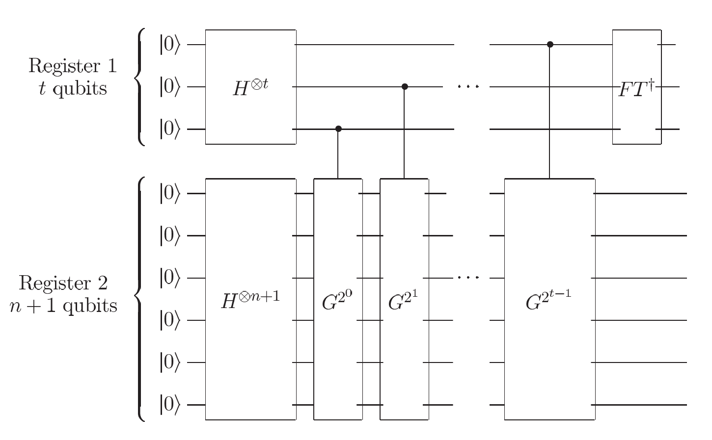

# Quantum Counting

So the question is how quickly can we determine the number of solutions, $M$, to an $N$ item search problem, if $M$ is not known in advance? Compare with classical computer, which requires $\Theta(N)$ consultations with an oracle to determin $M$, a quantum computer is able to estimate number of solutions much more quickly by combining Fourier transform.

Here are some key applications:

1.  If we can estimate the *number of solutions* quickly then it is also possible to find a solution quickly, even if the number of solutions is unknown. BY first counting the number of solutions, and then applying the quantum saerch algorithm to find a solution.

2.  To decide whether the solution even exist, depending on whether the numbert of solutions is zero, or non-zero. This is useful when we are facing NP-complete problems.

> The quantum counting technique only tells how many values $x$ satisfy $f(x)=1$, not what the solutions are.

> To actually find a solution, you run Grovers' search, which gives one solution with high probability.

## Phase estimation

Quantum counting is an application of the phase estimation procedure to estimate the eigenvalues of the Grover iteration $G$. Suppose $|a\rangle$ and $|b\rangle$ are two eigenvectors of the Grover iteration in the space spanned by $|a\rangle$ and $|\beta\rangle$. Let $\theta$ be the angle of rotation determined by the Grover iteration. From equation,

$$G = 
\begin{bmatrix}
\text{cos}\theta & -\text{sin}\theta \\
\text{sin}\theta & \text{cos}\theta
\end{bmatrix}
$$

where $\theta$ is a real number in the range $0$ to $\pi/2$ (assuming for simplicity that $M\leq N/2$), where

$$
\text{sin}\theta = \frac{2\sqrt{M(N-M)}}{N},
$$

we see that the corresponding eigenvalues are $e^{i\theta}$ and $e^{i(2\pi - \theta)}$. We expoand our search space to $2N$ to ensure that $\text{sin}^{2}(\theta/2) = M/2N$.

See below circuit, 

    
    

        Circuit for performing approximate quantum counting on a quantum computer
    

1.  **Goal**: To estimate $\theta$ to $m$ bits of accuracy, with probability of success at least $1-\epsilon$
2.  **Component**: 
    1.  **The first register**: $t \equiv m + \lceil \text{log}(2+\frac{1}{2\epsilon}) \rceil$ qubits, as per the phase estimation algorithm.
    2.  **The second register**: The second register is initialized to an equal superposition of all possible inputs $\sum_{x}|x\rangle$ by a `H` gate.

Since the state is a superposition of the eigenstates $|a\rangle$ and $|b\rangle$, so (by the results of sec 5.2) the circuit below gives us an estimate of $\theta$ or $2 \pi - \theta$ accurate to within $|\Delta \theta|\leq 2^{-m}$, with probability at least $1-\epsilon$. 

An estimate for $2\pi - \theta$ is claerly equivalent to an estimate of $\theta$ with the same level of accuracy, so effectively the phase estiamtion algorithm determines $\theta$ to an accuracy $2^{-m}$ with probability $1-\epsilon$.

Using the equation $\text{sin}^{2} = M/2N$ and our estimate for $\theta$ we obtain an estimate of the *number of solitions, $M$*. The error of M is 

$$
\begin{array}{ll}
\frac{|\Delta M|}{2N} & = |\text{sin}^{2}\bigg(\frac{\theta + \Delta \theta}{2} \bigg) - \text{sin}^{2}\bigg( \frac{\theta}{2} \bigg)| \\
 & =  \bigg(\text{sin}\bigg( \frac{\theta + \Delta \theta}{2}\bigg) + \text{sin}\bigg( \frac{\theta}{2} \bigg) \bigg)|\text{sin}\bigg(\frac{\theta + \Delta \theta}{2} \bigg) - \text{sin}\bigg( \frac{\theta}{2} \bigg)|
\end{array}
$$

From calculus $|\text{sin}(\frac{\theta + \Delta \theta}{2}) - \text{sin}(\frac{\theta}{2})| \leq \frac{|\Delta \theta|}{2}$ and trigonometry $|\text{sin}(\frac{\theta + \Delta \theta}{2})| < \text{sin}(\frac{\theta}{2}) + \frac{|\Delta \theta|}{2}$, 

$$
\frac{|\Delta M|}{2N} < \bigg( 2 \text{sin}\bigg(\frac{\theta}{2} \bigg) + \frac{|\Delta \theta|}{2} \bigg) \frac{|\Delta \theta|}{2}.
$$

Substituting $\text{sin}^{2}(\frac{\theta}{2}) = M/2N$ and $|\Delta \theta| \leq 2^{-m}$ gives our final estimate for the error in our estimate of $M$,

$$
|\Delta M| < \bigg(\sqrt{2MN} + \frac{N}{2^{m+1}}\bigg) 2^{-m}.
$$

!!! example 
    If we have $N = 1024$, $M = 16$, and $m = \rceil n/2 \lceil +1 = 6$, so $2^{-6} = 1/64$. We can calcualte $|\Delta M|$ as 

    $$
    |\Delta M| < \bigg(\sqrt{2MN} + \frac{N}{2^{m+1}}\bigg) 2^{-m} \approx 189.02 \cdot \frac{1}{64} \approx 2.95
    $$

    Estimated error in $M$ is $< 2.95$, so your quantum counting outputs somesthing close to $16$ (likr $15.2$), it's within the expected bound.

!!! Note 
    
    -   $O(\sqrt{N})$ refers to Grover search. 
        -   This call seach over a space of size $N$ with one unknown marked item
        -   It takes about $R = \frac{\pi}{4}\sqrt{N}$ iterations (oracle calls)
        -   Assume $M = 1$ when no knowledge of how many solutions 

    -   $O(\sqrt{M})$
        -   Refers to the accuracy of quantum counting
        -   You're trying to estimate $M$ (number of marked items)
        -   After running phase estimation and computing $\widehat{M}$, the estimate has an error of 

            $$
            |\Delta M| = O(\sqrt{M})
            $$

            where $m \approx 0.5\ \text{log }N$.

### I don't know how many M adhead of time

To perfoem Grover's algorithm, we need to know the number of solutions $M$ to choose the right number of iterations $R$. But in many cases, you don't know $M$ ahead of time.

To address issue, we can first use quantum counting algorithm to first estimate $\theta$ and $M$ to high accuracy using phase estimation, and then to apply the quantum search algorithm, repeating the Grover iteration a number of times determined by

$$
R = CI\bigg(\frac{\text{cos}^{-1}\sqrt{M/N}}{\theta} \bigg)
$$

with the estimates for $\theta$ and $M$ obtained by phase estimation substituted to determine $R$. Although your estimated $\theta$ can be a little off, with $m = \lceil n/2 \rceil +1$, the angular error stays within $3\pi/8$. This gives a success probability of at least $\text{cos}^{2}(\frac{3\pi}{8}) \approx 0.15$. even if phse estimation only succeeds $5/6$ of the time, the total success is 

$$
\frac{5}{6} \cdot 0.15 \approx 0.12
$$

which is still usable. We can repeat a few times to boost the probability.

## References 

[1]. M. A. Nielsen and I. L. Chuang, *Quantum Computation and Quantum Information*, 10th Anniversary Ed., Cambridge: Cambridge University Press, 2010.