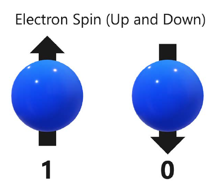
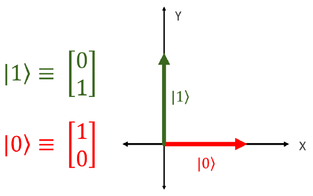

# Superposition, Entanglement and Reversibility

A quantum computer is a device that leverages specific properties described by quantum mechanics to perform computation.

*   **The Superposition Principle:** The linear combination of two or more state vectors is another state vector in the same Hilbert space and describes another state of the system.

## Superposition

A qubit, is a building block of quantum computers. Here we show how a property of an electron - namely spin - can be used to represent a one or zero of a qubit.

    
    

        Pair of electrons with a spin labeled 1 and 0. Ref[1]
    

We take two of these states and labeled them as the canonical one and zero for qubits.

    
    

        Zero and one states. Ref[1]
    

As you can see, the zero and one states are just vectors on the $x$ and $y$ axes with a length of one unit each. 

If we have a system that can take on one of two discrete state when measured, we can represent the two states in Dirac notation as $|0\rangle$ and $|1\rangle$. We can then represent a *superposition of states* as a linear combination of these states, such as 

$$
\psi\rangle = \alpha|0\rangle + \beta|1\rangle = \frac{1}{\sqrt{2}}|0\rangle + \frac{1}{\sqrt{2}}|1\rangle.
$$

In fact, when we measured it for a zero or one, $|\alpha|$ would give us the probability of getting a $0$, and $|\beta|$ would give us the probability of getting a $1$.

**The Born rule** states that the sum of the squares of the amplitudes of all possible states in the superposition is equal to 1. For state $|\psi\rangle = \alpha|0\rangle + \beta|1\rangle$, we have 
$$
|\alpha|^{2} + |\beta|^{2} = 1.
$$

## References
1.  Woody III, L. S. (2021). Essential mathematics for quantum computing. Packt Publishing. [https://www.packtpub.com/en-us/product/essential-mathematics-for-quantum-computing-9781801070188](https://www.packtpub.com/en-us/product/essential-mathematics-for-quantum-computing-9781801070188)
2.  Hidary, J. D. (2019). Quantum computing: An applied approach. Springer. [https://link.springer.com/book/10.1007/978-3-030-23922-0](https://link.springer.com/book/10.1007/978-3-030-23922-0)